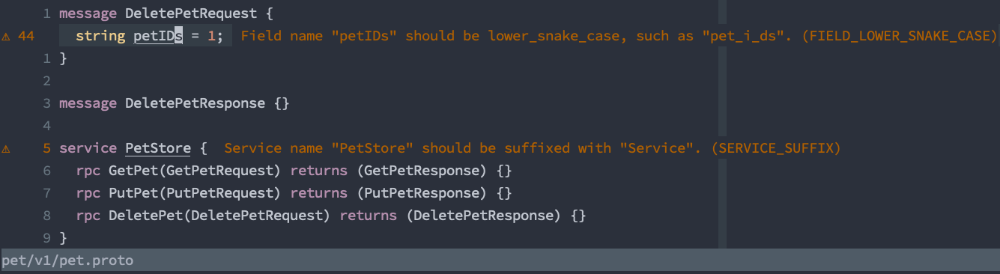

# coc-buf-lint

buf lint extension for [coc.nvim](https://github.com/neoclide/coc.nvim) based on [vscode-buf](https://github.com/bufbuild/vscode-buf)

## Install

In vim/neovim run

`:CocInstall coc-buf-lint`

## Features

- Lints your protobuf files using `buf lint`. It checks your currently opened file
  whenever you save it.

  

## Requirements

- [coc.nvim](https://github.com/neoclide/coc.nvim)
- [buf](https://docs.buf.build/installation)

## Extension Settings

This extension contributes the following settings:

- `buf.binaryPath`: configure the path to your buf binary. By default it uses `buf` in your `$PATH`.

## Commands

- `:CocCommand buf.lint`: trigger linting

---

> This extension is built with [create-coc-extension](https://github.com/fannheyward/create-coc-extension)
